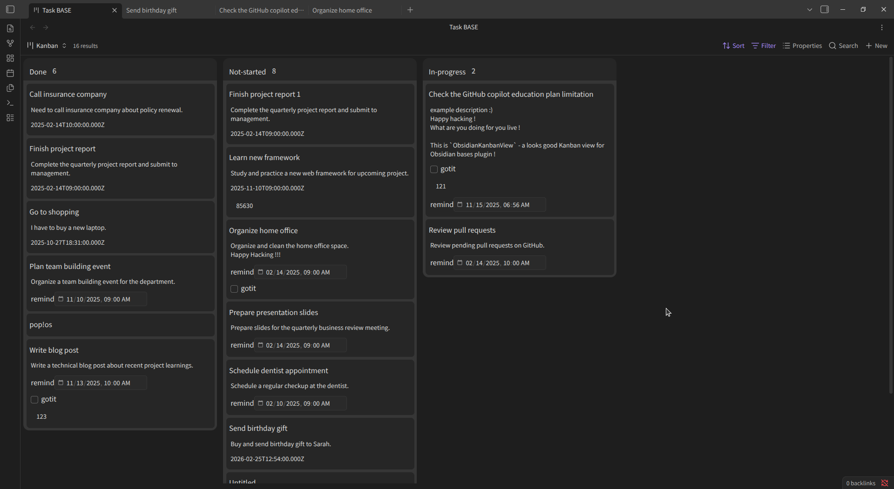

# Obsidian Kanban View

A powerful, intuitive Kanban board plugin for [Obsidian](https://obsidian.md/) that brings visual project management and task organization directly into your markdown-based workflow.

**Overview**


**Demonstration**
[Watch demonstration (MP4)](https://youtu.be/l_awr2Dn3ug)

## Features

- **Kanban Board Interface**: Visualize and manage tasks as draggable cards organized in customizable columns
- **Drag-and-Drop Support**: Seamlessly move cards and columns with mouse or touch gestures
- **Flexible Card Sizing**: Choose from small, medium, or large card layouts to suit your preferences
- **Column Customization**: Add custom colors to columns for better visual organization and categorization
- **Auto-Save**: Board layout and column order are automatically persisted to your vault
- **React-Powered UI**: Fast, responsive, and highly interactive user interface
- **Built-In Settings**: Configure board behavior and appearance directly within Obsidian
- **Markdown Native**: Cards maintain full integration with your markdown files, with metadata synchronized via frontmatter

## Installation

1. **Download the Plugin**
   - Clone or download this repository
   - Place it in your `.obsidian/plugins/` directory

2. **Install Dependencies**

   ```bash
   npm install
   ```

3. **Build the Plugin**

   ```bash
   npm run build
   ```

4. **Enable in Obsidian**
   - Open Obsidian Settings
   - Navigate to Community Plugins
   - Enable "Kanban view"

## Usage

- Open a Kanban board from the "Bases" menu in Obsidian
- Create and organize cards by dragging them between columns
- Edit card content directly within the board
- Card metadata syncs automatically with your markdown frontmatter
- Customize card sizes and column colors through the plugin settings panel

## Development

**Tech Stack**

- TypeScript, React, @dnd-kit (drag-and-drop), Obsidian API

**Available Commands**

- `npm run dev` – Lint, build, and copy files for development
- `npm run build` – Create production build
- `npm run watch` – Watch for file changes and rebuild automatically
- `npm run lint` – Lint TypeScript and JavaScript files

## License

Developed by Chihiro Watanabe
[GitHub](https://github.com/chi1180/)
